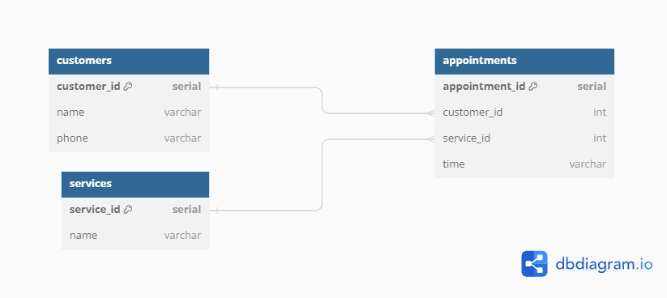

# Salon Appointment Scheduler

## Requirements
The goal of this project was to create a PostgreSQL database and bash scripts, to import csv data, that met the following requirements:
- [✅] 1. The database should be named `salon`
- [✅] 2. There should be tables named `customers`, `appointments`, and `services`
- [✅] 3. Each table should have a `SERIAL PRIMARY KEY` column as `<singular_table_name>_id`
- [✅] 4. `appointments` should have a `FOREIGN KEY` reference to `customer_id` and `service_id` with the same name as the referenced column
- [✅] 5. The `customers` table should have a `phone` column with `VARCHAR` and `UNIQUE` constraints
- [✅] 6. The `customers` and `services` tables should have a `name` column
- [✅] 7. The `appointments` table should have a `time` column with a `VARCHAR` data type
- [✅] 8. The `services` table should have at least three rows and one should have a `service_id` of `1`
- [✅] 9. Create a script file named `salon.sh` with executable permissions and a shebang for `#!/bin/bash`
- [✅] 10. Do not use `clear` in the script
- [✅] 11. Display a numbered list of services the form `#) <service>` e.g. `1) haircut`
- [✅] 12. Users should be prompted to enter `service_id`, `phone number`, `name` if not a customer, and `time`
- [✅] 13. After an appointment is successfully added, you should output the message I have put you down for a `<service>` at `<time>`, `<name>`

## Approach
For this assignment I consolidated all of the requirements into a checklist, to help myself keep track of and understand the requirements. I then created another mockup diagram of the database, to practice planning out the database schema. 
 
After creating the diagram, I created my `salon` database and tables. The PostgreSQL server is running within a linux docker container. 
I started by breaking down the script into smaller sections to piece together. The two main sections I came up with were the main menu and scheduling a service. Within scheduling a service I further broke that down into getting the customer phone number, getting their name if no record exists, adding the new customer to the database, getting the time for the appointment, and finally adding the appointment to the database.  
The `MAIN_MENU` function shows the list of the services available and then prompts the user for a service id. The service id is then passed into `SCHEDULE_SERVICE` which handles the rest of the scheduling process. If the user entered an invalid service id, the function returns to the main menu. If the service id is valid, the program prompts the user for their phone number to grab their customer id. If the customer is not in the database, the program prompts the user for their name and adds them to the database. Lastly, after getting the time from the customer, the program adds the appointment to the database and displays a confirmation message.

## Results
After working through the requirements and consolidating information, I was able to to easily create the database and tables. I was also able to write a bash script that successfully prompts a user for their desired service, phone number, name, and time. The script then adds the appointment to the database and displays a confirmation message for the customer and exits the program. The script also handles invalid inputs and prompts the user to try again.