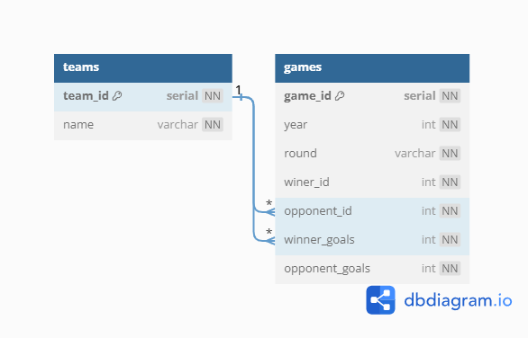

# World Cup database

## Requirements
The goal of this project was to create a PostgreSQL database and bash scripts, to import csv data, that met the following requirements:
- [✅] 1. The database should be named `worldcup`
- [✅] 2. There should be tables named `teams`, `games`
- [✅] 3. All columns should have a `NOT NULL` constraint
- [✅] 4. Each table should have a `SERIAL PRIMARY KEY` column as `<singular_table_name>_id`
- [✅] 5. The `teams` table should have a `name` column with a `UNIQUE` constraint
- [✅] 6. The `games` table should have the following columns:
    - `year` of type `INT`
    - `round` of type `VARCHAR`
    - `winner_id` and `opponent_id` that reference `team_id` in the `teams` table
    - `winner_goals`and `opponent_goals` of type `INT`
- [✅] 7. Both scripts should have execute permissions
- [✅] 8. Running `insert_data.sh` should add each unique team to the `teams` table and each game to the `games` table with correct information
- [✅] 9. Each query in `queries.sh` should be a single line and should return the correct information

## Approach
For this assignment I consolidated all of the requirements into a checklist, to help myself keep track of and understand the requirements. I then created another mockup diagram of the database, to practice planning out the database schema. 
 
After creating the diagram, I created my `worldcup` database and tables. The PostgreSQL server is running within a linux docker container. 
In the `insert_data.sh` script, I first checked if either the winning team or the opponent team already exists in the database. If they do not exist, I insert them, into the database, with the `insert_team` function that returns the id of the team after insertion. It's important to check the team id first, because the two columns reference the `team_id` and could cause errors trying to insert the game data. Finally, I just use an `INSERT` command to place games into the `games` table and print whether the action was successful or not. 
The last phase of this project was writing correct queries inside of `queries.sh`. Most queries are simple queries learned from the previous lesson `Building a student database`. They use a mix of `SUM`, `MAX`, `AVG`, and `COUNT` aggregate functions as well as `JOINS`. There was one query that did provide some difficulty in finding within documentation though. Getting the most goals scored by a single team across all games. This required a `GREATEST` expression, located within the Conditional Expressions section of the PostgreSQL documentation. Outside of that expression, the others were fairly simple to write.

## Results
After working through the requirements and consolidating information, I was able to to easily create the database and tables. I was also able to write a bash script that imports the games data into both tables successfully. After having data in the database, I wrote the queries already described in the `queries.sh` file. I now have a better understanding of how to bash scripts to automate entering data and querying a database. I also have a better understanding of how to use aggregate functions and joins to get the data I need from a database.