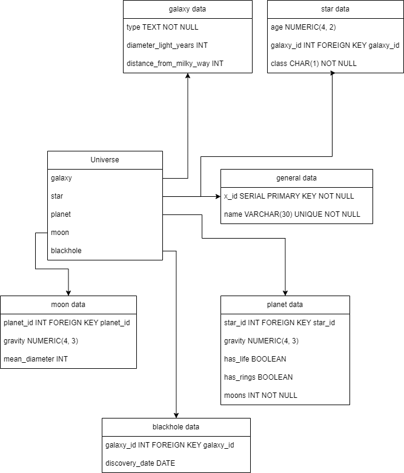

# Celestial database

## Requirements
The goal of this project was to create a PostgreSQL database that met the following requirements:
- [✅] 1. The database should be named `universe` and must contain at least five tables
- [✅] 2. There should be tables named `galaxy`, `star`, `planet`, `moon` and have at least five columns
- [✅] 3. Each table must have at least three rows and 3 columns
- [✅] 4. Each table should have a primary key that auto-increments
- [✅] 5. Each table should have a `name` column that is a `VARCHAR` data type
- [✅] 6. The `INT` and `BOOLEAN` data types should be used at least twice, excluding the primary or foreign keys
- [✅] 7. The `NUMERIC` and `TEXT` data types should be used at least once
- [✅] 8. At least two columns per table should have a `NOT NULL` constraint
- [✅] 9. At least one column should have a `UNIQUE` constraint
- [✅] 10. Each primary key should follow the naming convetion of `table_name_id`
- [✅] 11. Each foreign key should follow the naming convetion of the column it references
- [✅] 12. The `galaxy` and `star` tables should have at least six rows
- [✅] 13. The `planet` table should have at least 12 rows
- [✅] 14. The `moon` table should have at least 20 rows
- [✅] 15. Every `star` row should reference a row from the `galaxy` table
- [✅] 16. Every `planet` row should reference a row from the `star` table
- [✅] 17. Every `moon` row should reference a row from the `planet` table

## Approach
Before starting to write any code, I created a diagram of the database to help me visualize the relationships between the tables. This also helped in identifying all of the requirements of the database to minimize mistakes when creating statements to create the tables and entries. 

## Results
After creating the database, and troubleshooting all errors, I was able to succesfully pass all of the tests. The database can be found in the `universe.sql` file.